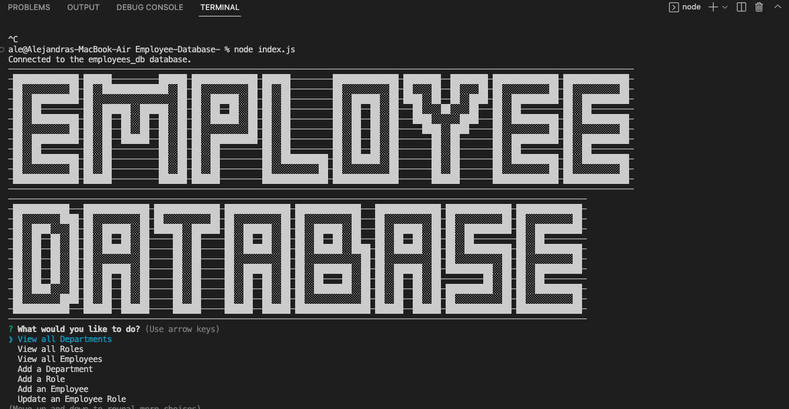

# Employee Database

## Description

This project is a command-line application using Node.js, Inquirer and MySQL. This program is an employee database which allows the user to see all of the employees, roles and departments within a fictious company. The most challenging aspect of this project was to get the syntax of the MySQL correct and integrating that syntax into inquirer. One of the exciting aspects of this project was seeing the changes in the database based off the easy user input of an employee. One of the SQL commands isnt formatted wihtt he correct syntax for updating an employee's role and doesnt work in the program. Having to do this project again a second time, I would be exciting to add a functional front end to the application which would still give the user an easy way to populate an employee database. 

## Installation 

In order to use this application, clone the repository onto your computer and install the dependancies into the project. Start the application using node index.js. 

## Usage 

Once the application has been installed and launched into the user's computer. The program will give the user a list of options to choose from. The user can view all departments, roles or employees in 

## Credits 

I recieved help from tutor Megan Meyers who helped me figure out the syntax for one of the SQL commands. 

## License 

MIT License

Copyright (c) [2022] [AlejandraQuintero]

Permission is hereby granted, free of charge, to any person obtaining a copy of this software and associated documentation files (the "Software"), to deal in the Software without restriction, including without limitation the rights to use, copy, modify, merge, publish, distribute, sublicense, and/or sell copies of the Software, and to permit persons to whom the Software is furnished to do so, subject to the following conditions:

The above copyright notice and this permission notice shall be included in all copies or substantial portions of the Software.

THE SOFTWARE IS PROVIDED "AS IS", WITHOUT WARRANTY OF ANY KIND, EXPRESS OR IMPLIED, INCLUDING BUT NOT LIMITED TO THE WARRANTIES OF MERCHANTABILITY, FITNESS FOR A PARTICULAR PURPOSE AND NONINFRINGEMENT. IN NO EVENT SHALL THE AUTHORS OR COPYRIGHT HOLDERS BE LIABLE FOR ANY CLAIM, DAMAGES OR OTHER LIABILITY, WHETHER IN AN ACTION OF CONTRACT, TORT OR OTHERWISE, ARISING FROM, OUT OF OR IN CONNECTION WITH THE SOFTWARE OR THE USE OR OTHER DEALINGS IN THE SOFTWARE.

